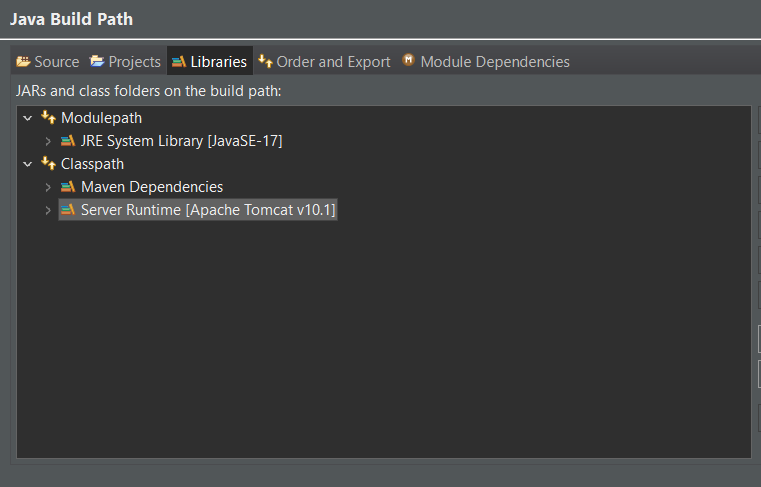
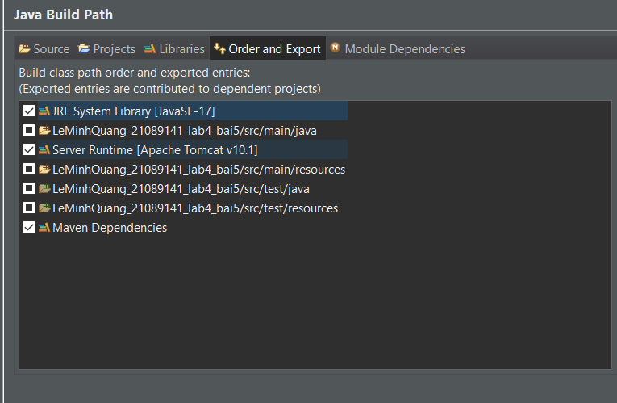
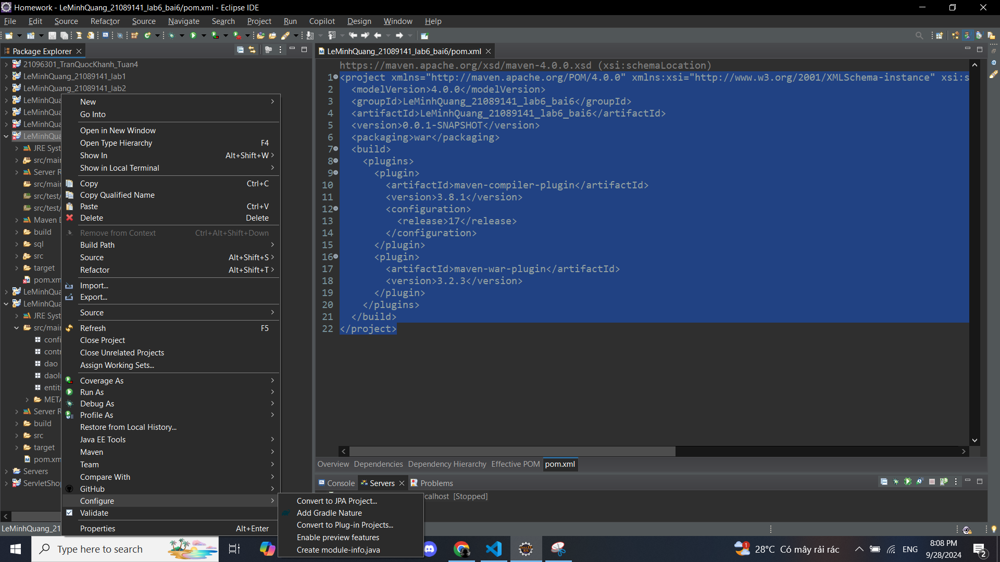

#  Topic 1: Setup servlet java

## 1/ Dynamic project web

- Build path:




- Project facets:

Chọn đúng version java: trong hình là Java 17.


- Build web

Truy cập vào cây thư mục, tìm file web.xml


Mẫu file

```javascript
  <build>
    <plugins>
      <plugin>
        <artifactId>maven-compiler-plugin</artifactId>
        <version>3.8.1</version>
        <configuration>
          <release>17</release>
        </configuration>
      </plugin>
      <plugin>
        <artifactId>maven-war-plugin</artifactId>
        <version>3.2.3</version>
      </plugin>
    </plugins>
  </build>
```

## 2/ Maven project

Chọn convert to Maven project (vì project mình đã setup sẵn nên không có option đó)



### Setup ```pom.xml```

File mẫu:

```javascript
	<dependencies>
		<!--  drive connect MSSQL  -->
		<dependency> 
			<groupId>com.microsoft.sqlserver</groupId>
			<artifactId>mssql-jdbc</artifactId>
			<version>12.8.1.jre11</version>
		</dependency>
		<!--  servlet api -> dùng method HTTP  -->
		<dependency>
			<groupId>jakarta.servlet</groupId>
			<artifactId>jakarta.servlet-api</artifactId>
			<version>6.0.0</version>
			<scope>provided</scope>
		</dependency>
		<!--  jsp api  -->
		<dependency>
			<groupId>jakarta.servlet.jsp</groupId>
			<artifactId>jakarta.servlet.jsp-api</artifactId>
			<version>3.1.1</version>
			<scope>provided</scope>
		</dependency>
		<dependency>
			<groupId>jakarta.servlet.jsp.jstl</groupId>
			<artifactId>jakarta.servlet.jsp.jstl-api</artifactId>
			<version>3.0.0</version>
		</dependency>
		<dependency>
			<groupId>org.glassfish.web</groupId>
			<artifactId>jakarta.servlet.jsp.jstl</artifactId>
			<version>3.0.1</version>
		</dependency>
        <!-- Jakarta Enterprise Beans phiên bean hay entity bean.-->
		<dependency>
			<groupId>jakarta.ejb</groupId>
			<artifactId>jakarta.ejb-api</artifactId>
			<version>4.0.1</version>
		</dependency>
        <!-- Cung cấp các chú thích chuẩn của Jakarta cho quản lý vòng đời và tài nguyên. -->
		<dependency>
			<groupId>jakarta.annotation</groupId>
			<artifactId>jakarta.annotation-api</artifactId>
			<version>3.0.0</version>
			<scope>provided</scope>
		</dependency>
        <!-- Cung cấp CDI cho môi trường Servlet -->
		<dependency>
			<groupId>org.jboss.weld.servlet</groupId>
			<artifactId>weld-servlet-core</artifactId>
			<version>5.1.2.Final</version>
		</dependency>
	</dependencies>
```

## 3/ ORM & JPA

### Cách 1: (Khuyên Dùng) Setup ORM Database persistence: 

 >Chú ý*: Eclipse default ORM Class trong package Entity. Vì vậy các Class ORM sang table phải nằm trong cùng 1 ```package entity```.

Cấu hình file ```persistence.xml```

```java

<persistence-unit
		name="LeMinhQuang_21089141_lab6_bai6">
		<provider>org.hibernate.jpa.HibernatePersistenceProvider</provider>
	
		<properties>
			<property name="jakarta.persistence.jdbc.driver"
				value="com.microsoft.sqlserver.jdbc.SQLServerDriver" />
			<property name="jakarta.persistence.jdbc.dialect"
				value="org.hibernate.dialect.SQLServerDialect" />
			<property name="hibernate.connection.url"
				value="jdbc:sqlserver://localhost:1433;databaseName=lmqBai6;trustServerCertificate=true;encrypt=true;" />
			<property name="hibernate.connection.username" value="sa" />
			<property name="hibernate.connection.password"
				value="sapassword" />
			<property name="hibernate.hbm2ddl.auto" value="update" />
			<property name="hibernate.show_sql" value="true" />
			<property name="hibernate.format_sql" value="true" />
		</properties>
	</persistence-unit>

```


### Cách 2: (Tham khảo) Setup Apache-Tomcat to init CSDL (DataSource) bind to (SQL Server)

- Truy cập file ``context.xml``


- Setup Datasource ```(Khuyên dùng persistence để ánh xạ, cách này chỉ !tham khảo)```

```javascript 
<Context>
	<Resource name="jdbc/bookStore" auth="Container"
		type="javax.sql.DataSource" maxTotal="100" maxIdle="30"
		maxWaitMillis="10000" username="sa" password="sapassword"
		driverClassName="com.microsoft.sqlserver.jdbc.SQLServerDriver"
		url="jdbc:sqlserver://localhost:1433;encrypt=false;databaseName = bookStore;" />
</Context>

```

```name="jdbc/bookStore"```: Đây là tên tài nguyên (Resource) mà ứng dụng của bạn sẽ tham chiếu đến.

```username="sa"```: Tên người dùng (username) để kết nối đến cơ sở dữ liệu. 

```password="sapassword"``` Mật khẩu để kết nối đến cơ sở dữ liệu với người dùng sa.

```url="jdbc:sqlserver://localhost:1433;encrypt=false;databaseName=bookStore;"``` : URL kết nối đến cơ sở dữ liệu
y
# Topic 2: Mô hình layer

```java
							+-------------------------+
							|      Presentation       |
							|    (GiangVienController)|  
							+-----------+-------------+
										|
										| HTTP Requests
										|
							+-----------v-------------+
							|        Service          |
							|   (GiangVienServices)   |
							+-----------+-------------+
										|
										| Calls
										|
							+-----------v-------------+
							|      Repository         |
							|   (GeneralRepository)   |
							+-----------+-------------+
										|
										| Interacts with
										|
							+-----------v-------------+
							|      EntityManager      |
							| (JPA/Hibernate)         |
							+-----------+-------------+
										|
										| Executes SQL Queries
										|
							+-----------v-------------+
							|      Database           |
							|   (SQL Server)          |
							+-------------------------+

```
### Cấu Trúc Ứng Dụng

1. **Presentation Layer**
   - **GiangVienController**: 
     - Xử lý các yêu cầu HTTP từ người dùng và trả về phản hồi. 
     - Tương tác với lớp dịch vụ để thực hiện các thao tác cần thiết.

2. **Service Layer**
   - **GiangVienServices**: 
     - Thực hiện các quy trình nghiệp vụ liên quan đến thực thể `GiangVien`.
     - Gọi đến lớp repository để thực hiện các thao tác trên cơ sở dữ liệu.

3. **Repository Layer**
   - **GeneralRepository**: 
     - Lớp chung cho tất cả các repository, thực hiện các thao tác cơ bản như tìm kiếm, lưu trữ và cập nhật dữ liệu.

4. **EntityManager**
   - Quản lý các thực thể và thực hiện các truy vấn SQL đến cơ sở dữ liệu.

5. **Database**
   - Cơ sở dữ liệu thực tế (SQL Server) nơi dữ liệu được lưu trữ.

### Create Entity

> Chú ý: Điều kiện  ORM thành công. Gồm: ```Class phải chứa @Id, @Entity, @Table và contructor không tham số.```

- Class Detai

```java
@Entity
@Table(name = "DETAI")
public class Detai {
	@Id
	@Column(name = "MADT")
	private String maDT;

	@Column(name = "TENDT", columnDefinition = "nvarchar(255)")
	private String tenDT;

	@Column(name = "NAMDANGKY")
	private String namDangKy;

	@Column(name = "MOTADETAI", columnDefinition = "nvarchar(255)")
	private String moTaDeTai;

	@ManyToOne
	@JoinColumn(name = "MAGV")
	private GiangVien giangVien;
	public Detai() {
		super();
	}
}
```
- Class Giangvien
```java

@Entity
@Table(name = "GIANGVIEN")
public class GiangVien {
	@Id
	@Column(name = "MAGV")
	private String maGV;

	@Column(name = "TENGV", columnDefinition = "nvarchar(255)")
	private String tenGV;

	@Column(name = "LINHVUCCHONDETAI", columnDefinition = "nvarchar(255)")
	private String linhVucChonDeTai;

	@Column(name = "SODIENTHOAI")
	private String soDienThoai;

	@OneToMany(mappedBy = "giangVien", cascade = CascadeType.ALL, orphanRemoval = true)
	private Set<Detai> dsDetai;

	public GiangVien() {
		super();
	}
}
```
### Connection Database
- Khởi tạo  connection tới DB
```java
public class GeneralRepository<T, ID> {
	private EntityManager entityManager;
	public GeneralRepository(String entityName) {
		this.entityName = entityName;
		entityManager = Persistence.createEntityManagerFactory("LeMinhQuang_21089141_lab6_bai6").createEntityManager();

	}
}
```
### Create General Repository

> Vì sao phải cần resposity: General Repository cung cấp một lớp trung gian giữa ứng dụng và cơ sở dữ liệu, giúp bạn có thể tái sử dụng các phương thức truy vấn cơ bản.

```java
public class GeneralRepository<T, ID> {
	private EntityManager entityManager;
	private String entityName;
	public static Connection con = null;

	public GeneralRepository(String entityName) {
		this.entityName = entityName;
		entityManager = Persistence.createEntityManagerFactory("LeMinhQuang_21089141_lab6_bai6").createEntityManager();

	}

	@SuppressWarnings("unchecked")
	public T findById(T entity, ID id) {
		return (T) entityManager.find(entity.getClass(), id);
	}

	@SuppressWarnings("unchecked")
	public List<T> findAll() {
		String sql = "Select * from " + entityName;
		List<T> rs = entityManager.createQuery(sql).getResultList();
		return rs;
	}

	public boolean saved(T entity) {
		EntityTransaction tx = entityManager.getTransaction();
		try {
			tx.begin();
			entityManager.persist(entity);
			tx.commit();
		} catch (Exception e) {

			tx.rollback();
			e.printStackTrace();
		}

		return true;
	}

}

```
- Có thể mở rộng bằng các viết 1 lớp trừu tượng General Repository Interface

```java
public interface GenericRepository<T, ID> {
    void save(T entity);
    T findById(ID id);
    List<T> findAll();
    void delete(T entity);
}
```
- ```(Tham khảo)```Sau đó tạo class implements  từ interface vừa khởi tạo. Có thể bỏ qua bước tạo interface nếu project nhỏ.

```java
public class DetaiRepository implements GenericRepository<Detai, Integer> {
    // Implement các phương thức cụ thể cho Detai
}
```

## Create services:
```java
public class GiangVienServices {
	GeneralRepository<GiangVien, String> repo;
	public GiangVienServices() {
		repo = new GeneralRepository<GiangVien, String>("GiangVien");
	}
	public GiangVien getById(String id) {
		return repo.findById(new GiangVien(), id);
	}
}
```
## Create controllers:

```java

@WebServlet(urlPatterns = "/giang-vien")
public class GiangVienController extends HttpServlet {
	private static final long serialVersionUID = 1L;
	public GiangVienController() {
		GiangVienServices giangVienService = new GiangVienServices();
	}
	protected void doGet(HttpServletRequest request, HttpServletResponse response)
			throws ServletException, IOException {
		// TODO Auto-generated method stub
		response.getWriter().append("Served at: ").append(request.getContextPath());
	}
}
```

